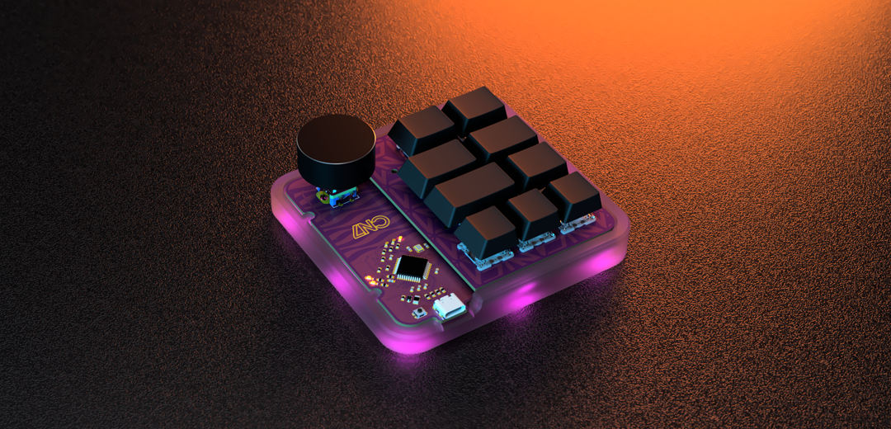

# CN7 Macropad

**CN7 Macropad** is a custom-built mechanical keyboard, packing features:
- 9 programmable keys made for shortcuts;
- layer-indication LEDs;
- rotary encoder for commands such as media control and CAD features like zoom, etc;
- RGB addressable LEDs for underglow and individual key-lightning;

